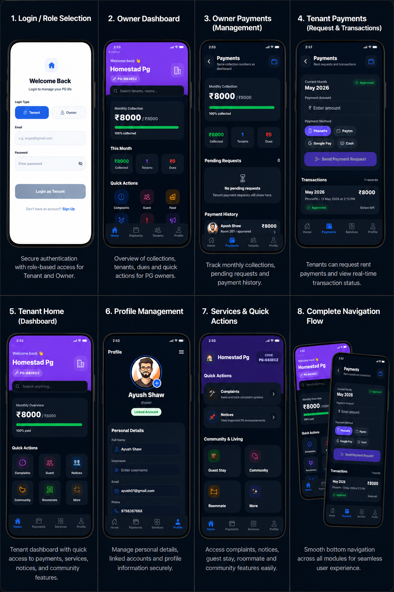

# Panchayat App — Multi-PG SaaS Management Platform

Panchayat App is a scalable multi-PG management platform built using React Native and Firebase.

It is designed for PG owners and tenants to manage payments, complaints, tenants, notices, services, and daily operations through separate role-based workflows.

> Production source code is private for architecture and security protection.  
> This repository showcases the project UI, features, architecture, and selected sample code.

---

## Project Preview

---

## Key Features

- Multi-PG SaaS architecture
- Owner and tenant role-based workflows
- Secure login and account linking
- Real-time payments management
- Real-time complaints system
- Tenant records management
- Services and quick actions
- Dark mode mobile-first UI
- Cloud media handling
- Firestore real-time synchronization

---

## Tech Stack

- React Native
- Expo Router
- Firebase Authentication
- Cloud Firestore
- AsyncStorage
- Cloudinary
- JavaScript

---

## App Sections

### Owner Section
- Dashboard overview
- Tenant management
- Payment collection
- Complaints and services handling

### Tenant Section
- Tenant dashboard
- Payment requests
- Complaints and notices
- Profile management
- Service requests

---

## Sample Code

Selected frontend sample code is available in the `Sample code` file.

The full production codebase is kept private.

---

## Developer

**Angad Kumar Shaw**  
GitHub: https://github.com/angadxscript  
LinkedIn: https://linkedin.com/in/angadxscript
